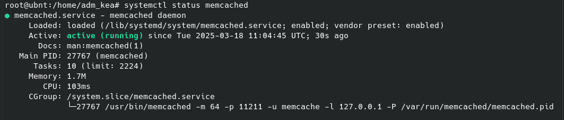

# Домашнее задание к занятию «Кеширование Redis/memcached» - Крюков Егор

### Задание 1. Кеширование 

Приведите примеры проблем, которые может решить кеширование. 

*Приведите ответ в свободной форме.*

---
### Решение
Кеширование решает несколько ключевых проблем, с которыми сталкиваются приложения при работе с данными
- Снижение нагрузки на сервер или базу данных. Например тысячи пользователей одновременно заходят на главную страницу сайта где отображается список популярных товаров. Если каждый раз запрашивать эти данные из базы то сервер будет перегружен, а пользователи начнут получать ошибки. Кеш сохранит эти данные в памяти, и серверу не придётся обрабатывать одни и те же запросы снова
- Уменьшение задержек из-за расстояний. Если пользователь из другой точки мира заходит на сайт, а сервер расположен в Европе, данные будут идти долго. Кеширование через CDN позволит хранить копию данных ближе к пользователю и сократить время загрузки. 
- Улучшение работы с медленным интернетом. Например мобильные приложения часто работают в условиях слабого сигнала. Если данные сохранены в кеше устройства, пользователь сможет просматривать их даже без доступа в интернет

---
### Задание 2. Memcached

Установите и запустите memcached.

*Приведите скриншот systemctl status memcached, где будет видно, что memcached запущен.*

---
### Решение

---
### Задание 3. Удаление по TTL в Memcached

Запишите в memcached несколько ключей с любыми именами и значениями, для которых выставлен TTL 5. 

*Приведите скриншот, на котором видно, что спустя 5 секунд ключи удалились из базы.*

---
### Решение

---
### Задание 4. Запись данных в Redis

Запишите в Redis несколько ключей с любыми именами и значениями. 

*Через redis-cli достаньте все записанные ключи и значения из базы, приведите скриншот этой операции.*

---

### Решение

